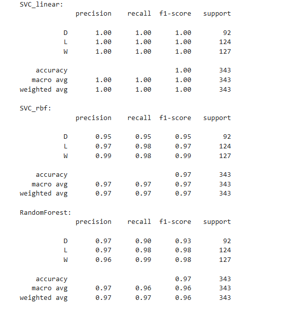

# Classification Model to Predict outcome of Football matches

## Table of Contents
1. [Project Description](#project-description)
2. [Installation](#installation)
3. [Usage](#usage)
4. [Results](#results)
5. [Examples](#examples)
6. [Contact Information](#contact-information)

## Project Description
In this modeling project, I trained a classification model to predict the outcome of football matches. The scope includes; web scrapping to collect historical match results for the 2022/2023 and 2023/2024 Premier League season, data transformation, cleaning, encoding of character data type, exploratory analysis to identify trends/patterns and relationships between data, and finally predictive modeling for match predictions.
The dataset consists of historic match results from the 2022/2023 and the just concluded season. key features include team, opponent, GL, Sh, SoT, GF, GA etc.

#### Prerequisites
To successfully run the code in the web scrapping and match prediction notebook, install the following modules
- Pandas
- NumPy
- matplotlib
- seaborn
- learn
- beautifulsoup4

Please execute the below line of code in your notebook to install the latest version of the above packages.
```python
!pip install pandas numpy matplotlib seaborn sklearn bs4

```

# Usage
---

### Data Preparation
Perform the following preprocessing on the dataset to make it suitable for the model and for optimal performance.

- Remove match records with missing feature values.
- Standardize team/opponent names
- Encode character features

### Running the model
split the dataset into training and test sets. since the data is a time series, split using dates such that training sets have later dates.

_Model selection:_ Three classification models namely; SVC-linear, SVC-rbf, and RandomForestClassifier were fitted to the training set. the best-performing model(SVC-linear) is used for predictions.

### Model Evaluation
The models' predictive performance on test sets is evaluated using the classification report metric. this provides a summary report containing model accuracy, f1_score, precision, and recall.

### Result
[]


Goto [Model](https://github.com/Gab001-data/Football-Match-Prediction-Model/blob/main/PL_match_prediction.ipynb)

